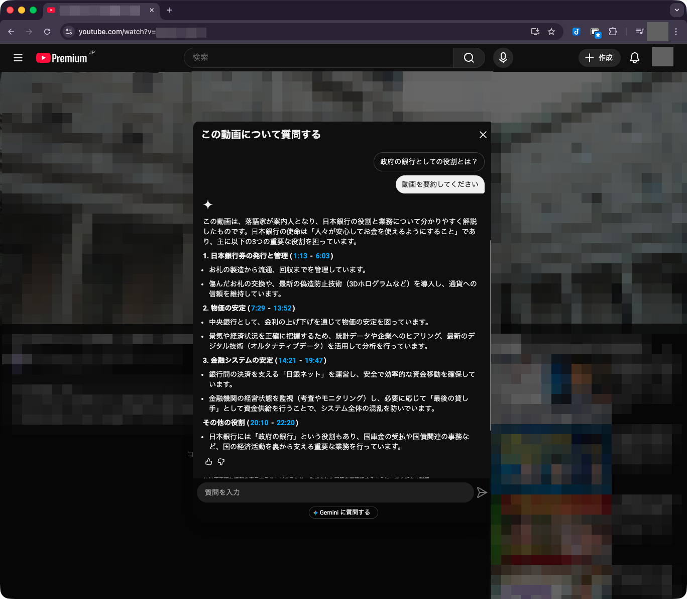
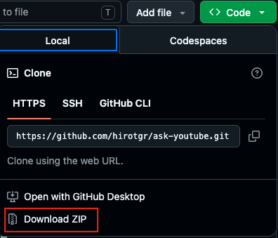
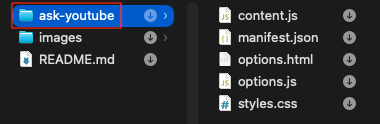
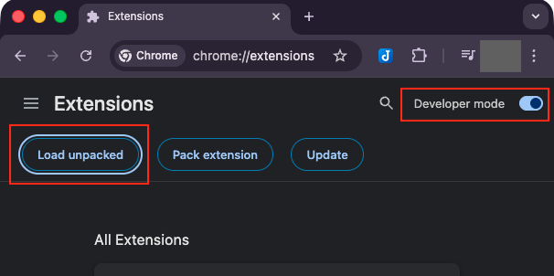
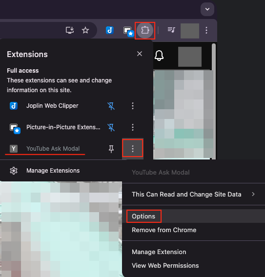
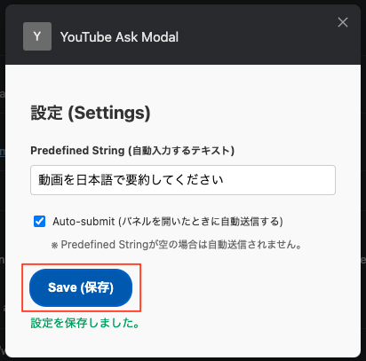
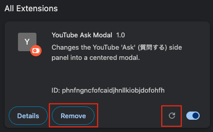

# YouTube Ask Modal Extension

YouTubeの「質問する」機能（Geminiチャット）を、サイドパネルから画面中央のモーダル（ポップアップ）表示へと変更し、さらに定型文の自動入力と自動送信機能を追加するChrome拡張機能です。

**開発者モード（Developer mode）が前提ですので、Chromeの設定に馴染みのない人は使わないでください。**（Chrome web storeには登録していません） \
セキュリティ等が不安な場合はGeminiやChatGPTにコードをアップロードしてセキュリティチェックなどをしてもらってください。

## 概要

### 主な機能

1. **画面中央へのモーダル表示**:
   動画の横に小さく表示される「質問する」パネルを、画面中央に大きく使いやすく表示します。周囲の背景は暗くなり（バックドロップ）、質問に集中できます。

2. **定型文の自動入力 (Predefined String)**:
   パネルを開いた際、「動画を要約する」などのよく使うフレーズを自動で入力します。

3. **自動送信 (Auto-submit)**:
   設定をオンにすると、「質問する」ボタンを押した瞬間に、自動入力されたフレーズを自動的に送信します。動画ごとに1クリックで要約や質問を送信できます。

4. **注意:** YouTube側の実装が変更されると機能しなくなる可能性があります。

### インストール

1. GitHub （`https://github.com/hirotgr/ask-youtube`）からリポジトリを ZIP形式でダウンロードします。

2. ask-youtube サブフォルダを任意の場所に保存します。他のフォルダ・ファイルは削除してください。

3. ChromeのURLバーに `chrome://extensions/` と入力して拡張機能管理ページを開きます。

4. 右上の「デベロッパー モード （Developer mode）」をオンにします。

5. 「パッケージ化されていない拡張機能を読み込む（Load unpacked）」ボタンをクリックし、この `ask-youtube` フォルダを選択します。

### 使い方・設定

1. ブラウザ右上のパズルアイコンから拡張機能のリストを開きます。

2. 「YouTube Ask Modal」の横にあるケバブメニュー（縦の3点リーダー）をクリックし、**オプション（Option）**を選択します。

3. 設定画面で以下のカスタマイズが可能です：
   - **Predefined String**: パネルが開いたときに自動入力される文字列です（デフォルト: `動画を要約する`）。
   - **Auto-submit**: チェックを入れると、パネルが開いた瞬間に自動で質問が送信されます。

4. 設定を保存後、新規のYouTubの動画ページを開き、動画下の「質問する」ボタンをクリックして動作を確認してください。

### アンインストール

1. ChromeのURLバーに `chrome://extensions/` と入力して拡張機能管理ページを開きます。

2. `削除（Remove）`をクリックして拡張機能を削除します。

(備考) 調子が悪い時はリロードアイコンをクリックしてください。

### 注意

- `chrome://extensions/` で拡張機能をリロードした場合、既に開いている YouTube タブもリロードしてください。古い content script はページ上に残りますが、拡張機能の context は無効化されるため、設定値の読み込みなどの extension API を利用できなくなります。
- この状態を検知した場合、拡張機能は未捕捉例外を出さないように監視処理を停止します。完全に動作を復旧するには YouTube タブのリロードが必要です。

---

## 詳細

本拡張機能は、最小権限の原則（PoLP）を遵守しつつ、YouTube特有のSPA（Single Page Application）仕様やモダンなUIフレームワーク（React/Polymer）に対応するための工夫が施されています。

### ディレクトリ構成
- `manifest.json`: Manifest V3準拠。権限は `storage` のみと最小限に抑えています。
- `content.js`: YouTubeのDOM監視、イベントの擬似発火、自動送信の制御を行います。
- `styles.css`: YouTubeの既存パネルのスタイルを上書きし、画面中央に固定配置するためのCSSです。
- `options.html` / `options.js`: 設定値（文字列、自動送信のオンオフ）の永続化とUIを提供します。

### 主要な技術的決定事項とセキュリティ対策

1. **SPA遷移における安全なDOM監視**
   - YouTubeは画面のリロードを伴わずに遷移するSPAです。マニフェストの `matches` を `/watch` のみに限定すると、トップページからの遷移時に拡張機能が読み込まれなくなる問題があります。
   - これを解決するため、`matches: ["https://www.youtube.com/*"]` としつつ、`content.js` 内でYouTubeのカスタムイベント `yt-navigate-finish` を監視しています。これにより、`/watch` ページにいる時だけ `MutationObserver` を起動し、他のページでは完全に監視を破棄・停止することで、パフォーマンスの悪化や対象外ページでの予期せぬ誤作動を完全に防いでいます。

2. **UIフレームワークへの安全なイベント注入**
   - テキスト入力やボタンの活性化を行う際、DOMの `disabled` 属性を拡張機能側から強制的に外す（ハック的なアプローチ）ことはせず、YouTube側の内部ステートとDOMを自然に同期させる安全な手法を採用しています。
   - テキストエリアへの値の設定には、Polymer/Lit 等のフレームワークによるプロパティのラップを回避するため、`HTMLTextAreaElement.prototype` の native setter を使用しています。native setter が利用できない場合にのみ通常の `input.value` 代入にフォールバックすることで、フレームワーク内部状態との二重書き込みを防いでいます。
   - その後、`keydown` / `keyup` イベントのディスパッチを行い、フレームワーク側が自然に送信ボタンを有効化するのを `MutationObserver` で監視・待機してからクリック（`.click()`）する設計になっています。

3. **厳格なクリックトラッキングによる意図しない自動送信の防止**
   - バックグラウンドでのタブ復元時などにパネルが勝手に開き、意図しない自動送信が実行されるのを防ぐため、`document` レベルでクリックイベントを監視しています。
   - 単なるクリックではなく、ユーザーが「質問する」ボタン（`.you-chat-entrypoint-button` 等）を**直接クリックした直後**にのみ自動送信フラグを立てることで、SPA特有のステート復元や再描画による自動送信の暴発を論理的にブロックしています。
   - パネルが既に展開済みの状態で Ask ボタンがクリックされた場合も、`clickHandler` 内で直接 `autoFillInput()` を呼び出すことで、`visibility` 属性変更イベントに依存せず確実に自動入力・送信処理を起動します。

4. **ストレージの安全性 (`storage.local`)**
   - オプションで設定した文字列（ユーザーの入力プロンプト）は、Googleアカウント間で同期される `storage.sync` ではなく、デバイス内に留まる `storage.local` に保存されます。これにより、意図せず機密情報がクラウドアカウントを介して他の端末に同期されるセキュリティリスクを排除しています。

5. **Extension context invalidated への防御**
   - 開発中の拡張機能リロードなどで content script の extension context が無効化された場合、`chrome.storage.local.get()` などの extension API 呼び出しは失敗します。
   - `content.js` は context の生存確認と例外処理を行い、無効化を検知したら `MutationObserver`、クリック監視、待機中のタイマーを停止します。古い content script からの自動復旧は行わず、タブリロード後に新しい content script として復旧します。

6. **スタッキングコンテキストの解決**
   - 背景を暗くするバックドロップ要素は、YouTubeの既存の `z-index` 階層の影響を避けるため、`document.body` ではなく、ターゲットとなるパネル要素の直前（`parentNode.insertBefore`）に動的に挿入されます。これにより、モーダル本体とバックドロップが常に同じスタッキングコンテキストに配置されるよう工夫されています。
   - SPA遷移やDOM再構築により backdrop 要素が DOM ツリーから切り離された場合は、`isConnected` プロパティで検知し、既存の参照を破棄して再作成します。また、`/watch` 以外のページへ遷移した際は `stopExtension()` 内で backdrop を DOM から完全に除去し、不要な要素が残留しないようにしています。

7. **自動送信の 2 フレーム待機 (`scheduleVisibleSubmit`)**
   - 送信ボタンのクリックは、`requestAnimationFrame` を 2 回ネストして 2 フレーム後に実行されます。これは、テキスト入力後のフレームワーク側のレンダリング更新（送信ボタンの有効化など）が完了してから送信を行うためです。
   - キャンセル安全性のため、`pendingSubmitFrame` 変数は各フレームの ID を追跡し、`clearPendingSubmitFrame()` でいつでも安全にキャンセルできる設計になっています。
